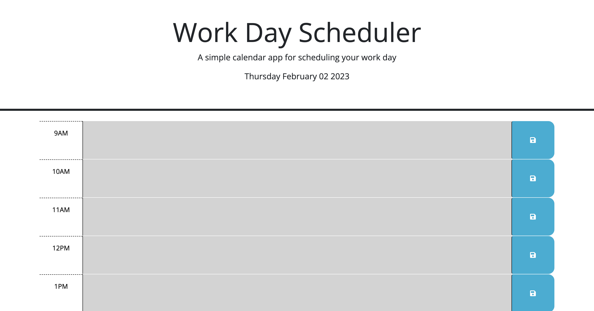
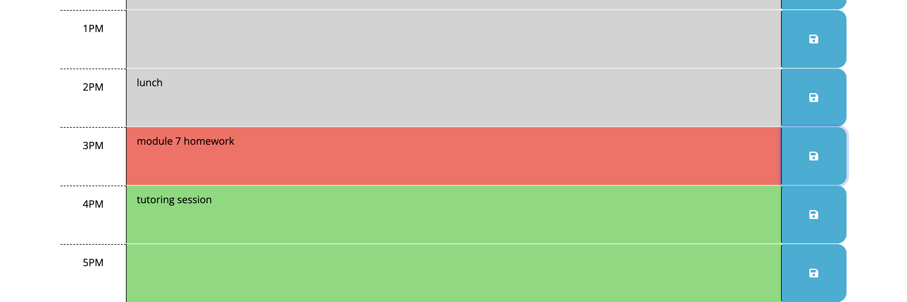

# Work Day Scheduler 

# Link to deployed application
https://alimomin7861.github.io/Work-Day-Scheduler/

# Visual Representation

# Overview 
The purpose of this project was to create a simple calendar application that allows a user to save events for each business hour of the day. The timeblocks are also color-coded to indicate which hour of the day it is presently, what hours have passed, and which hours are to come in the future. 
